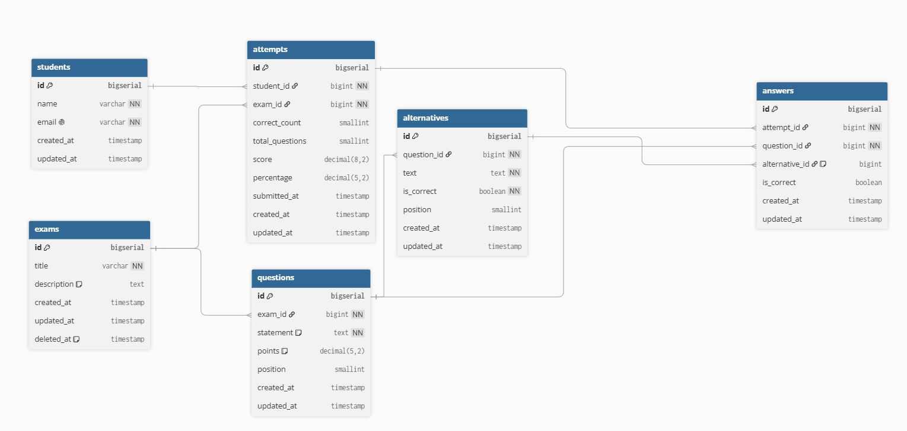

# Provas Fênix

Aplicação fullstack de provas online: professores criam provas de múltipla escolha, alunos respondem e recebem a correção automática, e um dashboard compara o desempenho da turma.

**Stack:** PHP 8.4 + Laravel · Vue 3 + TypeScript · PostgreSQL 17 · Redis 7 · Docker Compose

---

## Como rodar

Pré-requisitos: Docker e Docker Compose.

```bash
cp .env.example .env
docker compose up --build
```

Na primeira subida, o container do backend instala as dependências, cria o `.env` do Laravel, roda as migrations e popula o banco com dados de exemplo. Aguarde no log as mensagens `Server running on [http://0.0.0.0:8000]` e `VITE ... ready`.

| Serviço | Endereço |
| --- | --- |
| Frontend | http://localhost:5173 |
| API | http://localhost:8000/api |
| Documentação da API (OpenAPI) | http://localhost:8000/docs/api |

Se alguma porta já estiver em uso na sua máquina (por exemplo, um PostgreSQL local na 5432), altere apenas o número da esquerda em `ports` no `docker-compose.yml`.

### Dados de exemplo

Os seeders criam 8 alunos, 3 provas e tentativas já corrigidas, para o dashboard e o histórico abrirem preenchidos. A aluna **Mariana Costa** fica com uma prova pendente, para testar o fluxo de responder.

Para recomeçar do zero:

```bash
docker compose exec app php artisan migrate:fresh --seed
```

### Como usar

Não há login, conforme o enunciado. A tela inicial oferece dois acessos:

- **Sou professor:** cadastrar, editar e excluir provas, e acompanhar o dashboard.
- **Sou aluno:** escolher o nome, responder às provas pendentes e ver os resultados.

---

## Requisitos x telas

| Requisito | Onde está |
| --- | --- |
| Cadastro de provas, questões e respostas | Professor → Nova prova |
| Gerenciar provas (edição e exclusão) | Professor → Provas → Editar / Excluir |
| Dashboard: média, melhor e pior pontuação, comparativo entre alunos | Professor → Dashboard |
| Ranking paginado em grid | Professor → Dashboard → Ranking (com filtro por prova) |
| Acessar prova associada | Aluno → Minhas provas → Para fazer |
| Preencher questões | Aluno → Fazer prova |
| Correção automática, pontuação e percentual | Aluno → Resultado (logo após o envio) |
| Histórico de tentativas | Aluno → Minhas provas → Realizadas |
| Um aluno faz cada prova apenas uma vez | Validação no Service + índice único no banco (409) |
| Cada questão com apenas uma alternativa correta | Formulário + Form Request + índice único parcial no banco (422) |

---

## Testes

```bash
docker compose exec app php artisan test
docker compose exec app composer test:coverage   # falha se a cobertura ficar abaixo de 80%
docker compose exec app composer lint:check       # padrão de código (Pint)
docker compose exec frontend npm run lint
docker compose exec frontend npm run build        # inclui a verificação de tipos
```

Os testes rodam no banco `fenix_test`, separado do banco de desenvolvimento.

| Arquivo | Tipo | Cobre |
| --- | --- | --- |
| `GradingServiceTest` | Unitário, sem banco | Pesos, percentual, arredondamento, respostas em branco, precisão decimal |
| `ExamApiTest` | Feature | CRUD de provas, validações (422), 404, bloqueio de edição (409), soft delete |
| `AttemptApiTest` | Feature | Envio e correção, duplicidade (409), anti-fraude, gabarito oculto antes do envio |
| `StudentApiTest` | Feature | Provas com status por aluno, histórico com provas excluídas |
| `DashboardApiTest` | Feature | Métricas, ranking com empates e paginação, filtro, cache e invalidação |

**CI:** o GitHub Actions roda Pint, os testes com cobertura mínima de 80% (com PostgreSQL), o lint e o build do front a cada Pull Request e a cada push na `main`.

---

## Arquitetura

```
[ Vue (SPA) ] ──/api──► [ proxy do Vite ] ──► [ Laravel API ] ──► [ PostgreSQL ]
                                                     │
                                                     └──────────► [ Redis (cache) ]
```

Frontend e API são desacoplados. O proxy do Vite coloca os dois na mesma origem para o navegador, então não há CORS para configurar.

### Backend: camadas

```
Rota → Form Request → Controller → Service → Model → Resource → JSON
       (valida)       (só delega)  (regras)  (Eloquent) (formata)
```

| Camada | Pasta | Responsabilidade |
| --- | --- | --- |
| Form Request | `app/Http/Requests` | Validação do formato dos dados (422) |
| Controller | `app/Http/Controllers/Api` | Recebe e delega; uma ou duas linhas por método |
| Service | `app/Services` | Regras de negócio, transações e cache |
| Model | `app/Models` | Dados e relacionamentos |
| Resource | `app/Http/Resources` | Formato do JSON; versões separadas para professor e aluno |
| Exceção | `app/Exceptions` | Erros de negócio com status próprio (409) |

A correção fica isolada no `GradingService`, que não acessa banco nem HTTP e por isso tem testes unitários puros. O resultado é devolvido num DTO imutável (`GradingResult`).

### Frontend

```
frontend/src/
├── services/     única camada que conhece a API (axios + interceptor de erros)
├── types/        tipos das respostas da API (contrato com o backend)
├── views/        uma tela por rota
├── components/   componentes reutilizáveis (paginação)
└── router/       rotas de professor e aluno, com lazy loading
```

---

## Banco de dados



| Regra | Como é garantida |
| --- | --- |
| No máximo uma alternativa correta por questão | Índice único parcial: `ON alternatives (question_id) WHERE is_correct = true` |
| Uma tentativa por aluno por prova | Índice único em `attempts (student_id, exam_id)` |
| Uma resposta por questão em cada tentativa | Índice único em `answers (attempt_id, question_id)` |
| Histórico preservado ao excluir uma prova | Soft delete em `exams` + chave estrangeira `restrict` em `attempts` |
| Ranking rápido | Índice em `attempts (exam_id, score)` |

- O PostgreSQL não indexa chaves estrangeiras automaticamente, então `exam_id` e `question_id` têm índices explícitos.
- `score` e `percentage` ficam gravados na tentativa (desnormalização consciente): o dashboard e o ranking leem esses valores o tempo todo.
- `is_correct` em `answers` congela o resultado no momento da correção.
- Pontuações usam `decimal`, e a soma é feita em centésimos inteiros, sem erros de arredondamento de ponto flutuante.

---

## API

Documentação completa e interativa em **http://localhost:8000/docs/api**, gerada pelo Scramble a partir dos Form Requests e Resources.

| Método | Rota | Descrição |
| --- | --- | --- |
| GET | `/api/exams` | Lista provas (paginada) |
| POST | `/api/exams` | Cria prova com questões e alternativas |
| GET | `/api/exams/{exam}` | Detalhe com gabarito (professor) |
| PUT | `/api/exams/{exam}` | Edita; 409 se a prova já tiver tentativas e as questões mudarem |
| DELETE | `/api/exams/{exam}` | Exclusão lógica |
| GET | `/api/students` | Lista alunos |
| GET | `/api/students/{student}/exams` | Provas com o status do aluno |
| GET | `/api/students/{student}/exams/{exam}` | Prova para responder, sem gabarito |
| POST | `/api/students/{student}/exams/{exam}/attempts` | Envia e corrige; 409 se já realizada |
| GET | `/api/students/{student}/attempts` | Histórico do aluno |
| GET | `/api/attempts/{attempt}` | Resultado detalhado |
| GET | `/api/dashboard` | Métricas gerais, por prova e por aluno |
| GET | `/api/dashboard/ranking` | Ranking paginado (`page`, `per_page`, `exam_id`) |

Todos os erros são retornados em JSON: 422 (validação), 404 (não encontrado) e 409 (regra de negócio).

